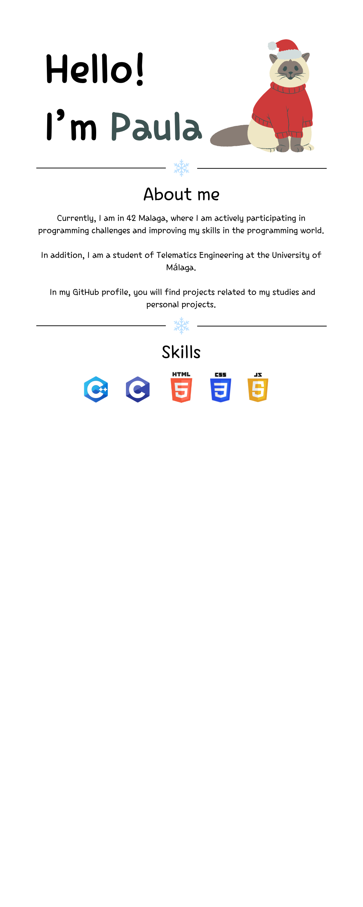

  

###

  <h3>About me </h3>

  Currently, I am in 42 Malaga, where I am actively participating in programming challenges and improving my skills in the programming world.

  In addition, I am a student of Telematics Engineering at the University of Málaga.

  In my GitHub profile, you will find projects related to my studies and personal projects.

<!--

  

-->

###
<h3 align="center">42 Projects </h3>

###

<h3 align="center">My Stats </h3>

###

  

